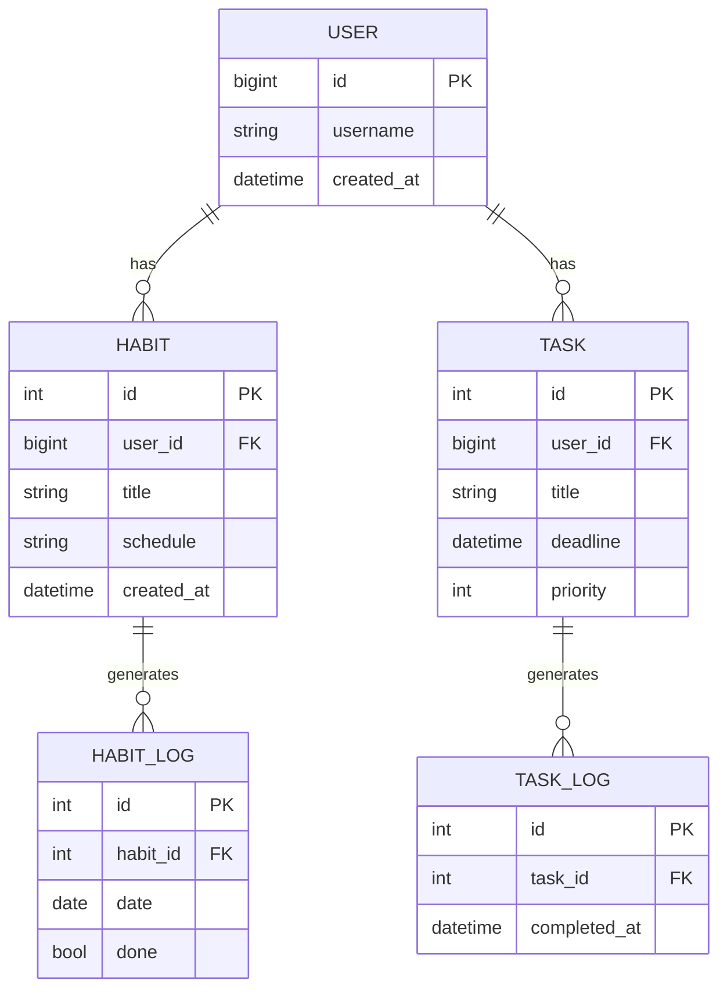

## ER Diagram

```mermaid
erDiagram
    USER ||--o{ HABIT : "has"
    USER ||--o{ TASK : "has"
    HABIT ||--o{ HABIT_LOG : "generates"
    TASK ||--o{ TASK_LOG : "generates"

    USER {
        bigint id PK
        string username
        datetime created_at
    }

    HABIT {
        int id PK
        bigint user_id FK
        string title
        string schedule
        datetime created_at
    }

    HABIT_LOG {
        int id PK
        int habit_id FK
        date date
        bool done
    }

    TASK {
        int id PK
        bigint user_id FK
        string title
        datetime deadline
        int priority
    }

    TASK_LOG {
        int id PK
        int task_id FK
        datetime completed_at
    }
```
